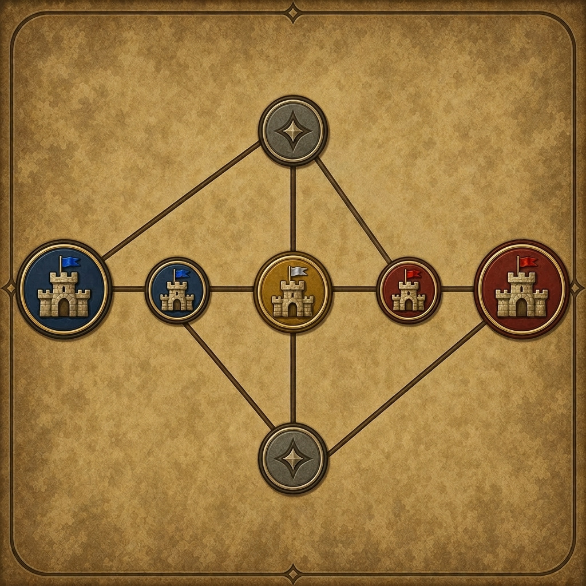

# Ways Around

  

`Ways Around` es una plantilla aleatoria para 2 jugadores en modo `Single Hero` para *Heroes of Might and Magic: Olden Era*, construida alrededor de dos rutas de ataque diferenciadas: un flanqueo exterior y una ruptura por el centro. El mapa combina cruces directos de alto valor, portales de retorno hacia la zona inicial de cada jugador y una condición de victoria por torneo que mantiene la presión incluso cuando ambos jugadores evitan el contacto directo.

## Resumen

- 2 jugadores
- modo `Single Hero`
- victoria por torneo al mejor de 3
- 7 zonas: 3 por jugador y 1 zona central neutral
- sin Cajas de Pandora
- la magia neutral queda limitada a `Coger aliento`; los héroes iniciales también reciben `¡De vuelta a la ciudad!` y `Reubicación` a coste 0
- portales de retorno desde zonas disputadas hacia la zona inicial de cada jugador

## Condiciones de victoria

- Victoria por torneo al mejor de 3
- Las batallas de torneo se celebran en los días `12`, `19` y `26`
- También se puede ganar derrotando al héroe rival en el mapa de aventura
- También se pierde al perder la ciudad inicial

## Jugabilidad

Cada jugador empieza en una zona inicial con acceso a dos opciones de avance:

- una ruta exterior a través de su ciudad lateral
- una ruta más directa a través de su zona central de tesoro vinculada

Ambas rutas terminan abriéndose hacia territorio disputado y hacia el rival. La zona central es el área de mayor valor del mapa, pero también la más defendida y la más expuesta a disputa directa. Las rutas laterales crean un arco de ataque más largo, mientras que los accesos centrales generan contacto más rápido y presión más directa.

Los portales de retorno reducen el tiempo muerto tras comprometerse hacia afuera. Permiten proyectar fuerza en zonas disputadas sin perder una vía rápida de vuelta hacia la base.

## Topología del mapa

El mapa tiene 7 zonas:

- `Spawn-A`
- `Side-A`
- `Center-A`
- `Center`
- `Center-B`
- `Side-B`
- `Spawn-B`

Conexiones terrestres directas:

- `Spawn-A <-> Side-A`
- `Spawn-A <-> Center-A`
- `Side-A <-> Center`
- `Side-A <-> Center-B`
- `Center <-> Center-A`
- `Center <-> Center-B`
- `Side-B <-> Center`
- `Side-B <-> Center-A`
- `Spawn-B <-> Center-B`
- `Spawn-B <-> Side-B`

Portales de retorno unidireccionales:

- `Side-A -> Spawn-A`
- `Center-A -> Spawn-A`
- `Side-B -> Spawn-B`
- `Center-B -> Spawn-B`

## Rol de las zonas

| Zona | Rol | Elementos principales | Perfil esperado de recompensas |
|---|---|---|---|
| `Spawn-A`, `Spawn-B` | Zonas iniciales | Ciudad inicial, minas tempranas, bancos tempranos, moradas de facción T1/T2 de un solo uso, Espejo del mundo | Economía temprana y primeras limpiezas seguras |
| `Side-A`, `Side-B` | Zonas laterales de presión | Ciudad lateral, paquete económico, bancos T3 guardados, Espejo del mundo, ruta hacia tesoro rival/centro | Fuerte economía de midgame y ruta de presión |
| `Center-A`, `Center-B` | Zonas avanzadas de tesoro | Sin ciudad, Laboratorio de investigación, Chapitel celestial, moradas de facción T5/T6 de un solo uso, Espejo del mundo | Tesoro de alto valor y herramientas avanzadas de tempo |
| `Center` | Zona central de conflicto | Ciudad neutral con Cofradía de magos V preconstruida y toda la demás construcción bloqueada, Utopía de Dragones, Laboratorio de investigación, varias estructuras mágicas, 4 Pozos | Zona de mayor valor y más disputada |

## Expectativa de recompensas

La distribución de valor entre zonas es intencionadamente desigual:

- `Center` es la zona premium
- `Center-A` y `Center-B` son zonas de tesoro fuertes, pero por debajo de `Center`
- `Side-A` y `Side-B` son zonas laterales ricas, con control de ciudad y acceso a bancos potentes
- `Spawn-A` y `Spawn-B` son zonas iniciales más contenidas, con economía garantizada y menor techo total

## Instalación

La plantilla necesita tres destinos de instalación:

1. Carpeta de plantilla:
   Copia la carpeta completa `Ways Around` en `StreamingAssets/map_templates/`.

2. Zip de assets:
   Coloca [`WaysAroundAssets.zip`](./WaysAroundAssets.zip) en la raíz de `StreamingAssets/`.

Resultado esperado:

- `StreamingAssets/map_templates/Ways Around/...`
- `StreamingAssets/WaysAroundAssets.zip`

Reinicia el juego después de actualizar el zip.

## Archivos

- [`WaysAround.rmg.json`](./WaysAround.rmg.json): plantilla principal
- [`WaysAround.png`](./WaysAround.png): imagen de vista previa
- [`WaysAroundAssets.zip`](./WaysAroundAssets.zip): paquete DB de assets
